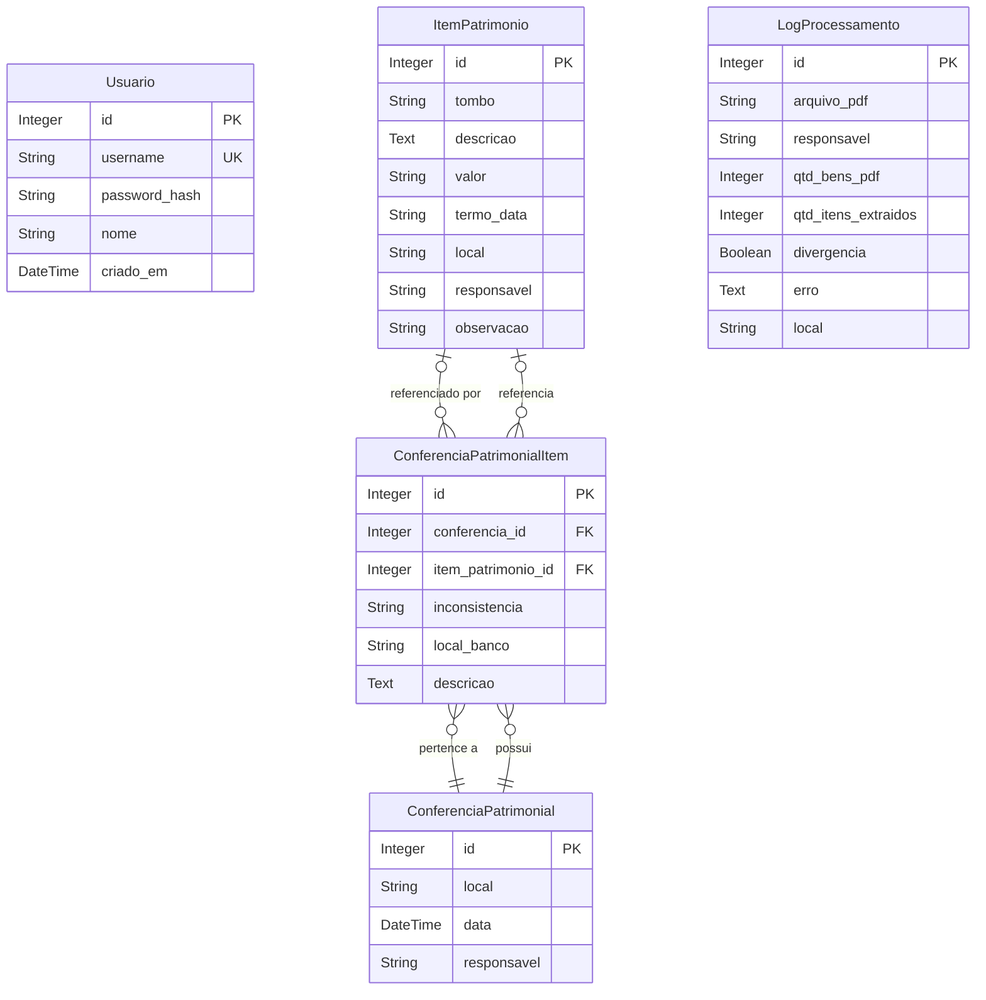

# Sistema de Inventário de Patrimônio

## Visão Geral

Este projeto é um sistema web para controle, conferência e inventário de patrimônio institucional, desenvolvido em Flask. Permite importar dados de PDFs, consultar e filtrar itens, realizar conferências patrimoniais por sala/local, gerar relatórios de conferência e manter histórico de conferências.

---

## Funcionalidades

- **Autenticação de Usuários**: Sistema seguro de login/logout com senhas criptografadas.
- **Cadastro de Usuários**: Registro de novos usuários com validação de dados.
- **Importação de PDFs**: Extração automática de itens de patrimônio a partir de arquivos PDF.
- **Consulta e Filtros**: Visualização dos itens cadastrados, com filtros por local, responsável e número do tombo.
- **Conferência Patrimonial**: Realize conferências por sala, digitando os tombos encontrados e gerando relatório de conferência.
- **Cadastro Automático**: Itens desconhecidos identificados em conferência são cadastrados automaticamente.
- **Histórico de Conferências**: Salve e consulte conferências anteriores, com detalhamento dos itens encontrados, faltantes, desconhecidos e em local divergente.
- **Logs de Processamento**: Acompanhe o resultado da importação de PDFs.
- **Controle de Acesso**: Rotas protegidas, acessíveis apenas para usuários autenticados.

---

## Requisitos

- Python 3.8+
- SQLite (padrão, já incluso)

### Bibliotecas Python
Veja `requirements.txt`:
- Flask
- Flask-SQLAlchemy
- Flask-Migrate
- Flask-Login
- Flask-WTF
- WTForms
- pdfplumber
- Werkzeug

---

## Instalação

1. Clone o repositório:
   ```bash
   git clone <url-do-repositorio>
   cd utf-patrimonio
   ```
2. Crie e ative um ambiente virtual:
   ```bash
   python3 -m venv venv
   source venv/bin/activate
   ```
3. Instale as dependências:
   ```bash
   pip install -r requirements.txt
   ```
4. Configure a aplicação (opcional: `.env` ou variáveis de ambiente).

---

## Migração do Banco de Dados

1. Inicialize as migrações (apenas na primeira vez):
   ```bash
   flask db init
   ```
2. Gere as migrações:
   ```bash
   flask db migrate -m "Criação das tabelas iniciais"
   ```
3. Aplique as migrações:
   ```bash
   flask db upgrade
   ```

---

## Primeiro Acesso

Crie o primeiro usuário administrador:
```bash
python3 criar_usuario.py
```
Informe username, nome completo e senha quando solicitado.

---

## Como Usar

### Opção 1: Execução Local

1. Execute a aplicação:
   ```bash
   python run.py
   ```
2. Acesse no navegador em `http://localhost:5001`

### Opção 2: Docker Compose (Recomendado)

1. Build e execute o container:
   ```bash
   docker-compose up --build
   ```
   
   Ou para executar em segundo plano:
   ```bash
   docker-compose up -d --build
   ```

2. Acesse no navegador em `http://localhost:5001`

3. Para parar o container:
   ```bash
   docker-compose down
   ```

4. Criar o primeiro usuário (com container rodando):
   ```bash
   docker-compose exec web python3 criar_usuario.py
   ```

> **Nota sobre Docker:** As migrações do banco são executadas automaticamente ao iniciar o container. O diretório do projeto é montado como volume, permitindo desenvolvimento com hot-reload.

### Rotas Disponíveis

- Login: `http://localhost:5001/login`
- Cadastro: `http://localhost:5001/register`
- Home: `http://localhost:5001/`
- Importar PDFs: `http://localhost:5001/upload`
- Itens: `http://localhost:5001/patrimonios`
- Conferências: `http://localhost:5001/conferencias_patrimoniais`
- Nova Conferência: `http://localhost:5001/conferencia_patrimonial`
- Conferência Manual: `http://localhost:5001/conferencia_patrimonial/manual`
- Logs: `http://localhost:5001/logs`
- Usuários: `http://localhost:5001/usuarios`

> **Nota:** Todas as rotas exceto a home requerem autenticação.

---

## Estrutura do Projeto

```
utf-patrimonio/
├── app/
│   ├── __init__.py
│   ├── config.py
│   ├── extensions.py
│   ├── models.py
│   ├── auth/
│   │   ├── __init__.py
│   │   ├── forms.py
│   │   └── routes.py
│   ├── patrimonio/
│   │   ├── __init__.py
│   │   ├── forms.py
│   │   ├── routes.py
│   │   ├── services.py
│   │   └── utils.py
│   ├── templates/
│   │   ├── base.html
│   │   ├── login.html
│   │   ├── register.html
│   │   ├── upload.html
│   │   ├── patrimonios.html
│   │   ├── logs.html
│   │   ├── conferencia_patrimonial.html
│   │   ├── conferencias_patrimoniais.html
│   │   ├── conferencia_patrimonial_detalhe.html
│   │   ├── conferencia_patrimonial_manual.html
│   │   ├── editar_conferencia_patrimonial.html
│   │   ├── editar_item_levantamento.html
│   │   ├── 404.html
│   │   └── 500.html
│   └── static/
├── docs/
│   ├── autenticacao.md
│   └── regra-conferencia.md
├── instance/
│   └── app.db
├── migrations/
│   └── versions/
├── uploads/
├── requirements.txt
├── criar_usuario.py
├── run.py
└── README.md
```

---

## Diagrama do Banco de Dados



---

## Observações
- O sistema utiliza SQLite por padrão, mas pode ser adaptado para outros bancos.
- O upload de PDFs e o processamento dependem do layout dos arquivos.
- A conferência patrimonial permite salvar e consultar históricos para auditoria.
- Todas as senhas são criptografadas usando Werkzeug.
- O sistema cria automaticamente itens patrimoniais para tombos desconhecidos identificados em conferências.

---

## Segurança

- **Autenticação**: Flask-Login gerencia sessões de usuário
- **Senhas**: Criptografadas com `werkzeug.security`
- **Proteção de Rotas**: Decorator `@login_required` protege endpoints sensíveis
- **CSRF**: Proteção automática via Flask-WTF
- **Sessões**: Suporte a "lembrar-me" para conveniência do usuário

---

## Regras de Negócio

### 1. Cadastro e Importação de Itens

- **Importação de PDFs:**
  - O sistema permite importar arquivos PDF contendo listas de bens patrimoniais.
  - Cada item extraído do PDF é cadastrado como um `ItemPatrimonio`, contendo: tombo, descrição, valor, termo/data, local, responsável e observação (nome do PDF ou outra informação relevante).
  - Se um item já existe (mesmo tombo, local e observação), não é duplicado.

- **Cadastro Manual:**
  - É possível cadastrar itens manualmente durante a conferência patrimonial.
  - Para itens sem etiqueta (sem tombo), apenas a descrição é obrigatória.
  - Para itens novos descobertos em conferência, o campo `observacao` recebe "Item identificado em conferência manual".

- **Cadastro Automático:**
  - Quando um tombo desconhecido é identificado em conferência, o sistema cria automaticamente um `ItemPatrimonio`.
  - O item é vinculado ao local e responsável da conferência.
  - Permite rastreabilidade e regularização posterior.

### 2. Conferência Patrimonial

- **Processo de Conferência:**
  - O usuário informa o local, responsável e a lista de tombos (via campo de texto ou importação de CSV).
  - O sistema compara os tombos informados com os itens cadastrados no banco para aquele local.

- **Classificação dos Itens na Conferência:**
  - **Encontrado no local correto:**
    - O tombo informado existe no banco e está cadastrado para o local da conferência.
    - `inconsistencia = 'ok'`
  - **Encontrado em outro local:**
    - O tombo existe no banco, mas está cadastrado para outro local.
    - `inconsistencia = 'local_divergente'`
  - **Item novo (não cadastrado):**
    - O tombo não existe no banco. O sistema cria automaticamente o `ItemPatrimonio`.
    - `inconsistencia = 'item_novo'`
  - **Não encontrado:**
    - O tombo está cadastrado no banco para o local, mas não foi encontrado fisicamente.
    - `inconsistencia = 'nao_encontrado'`
  - **Sem etiqueta:**
    - O item foi informado sem tombo (apenas descrição).
    - `inconsistencia = 'sem_etiqueta'`

- **Regras de Referência:**
  - Todo item de conferência (`ConferenciaPatrimonialItem`) sempre referencia um `ItemPatrimonio` existente (exceto itens sem etiqueta).
  - Se o tombo não existe, o sistema cria automaticamente o `ItemPatrimonio` antes de referenciar.
  - Itens sem etiqueta não criam `ItemPatrimonio` (`item_patrimonio_id = NULL`).

### 3. Logs de Processamento

- Cada importação de PDF gera um registro de log (`LogProcessamento`), contendo:
  - Nome do arquivo importado
  - Responsável
  - Quantidade de bens informada no PDF
  - Quantidade de itens extraídos
  - Divergência (se houver diferença entre quantidade informada e extraída)
  - Erro (se houver)
  - Local (extraído do PDF)

### 4. Visualização e Filtros

- **Itens do Patrimônio:**
  - Podem ser filtrados por tombo, local e responsável.
  - Permite ordenação por qualquer campo, inclusive observação.

- **Conferências Patrimoniais:**
  - Histórico de todas as conferências realizadas, com detalhamento dos itens classificados em cada uma.
  - Permite ordenação por ID, local, responsável e data.

### 5. Exclusão e Edição

- **Itens:**
  - Não podem ser excluídos automaticamente ao remover uma conferência, pois podem estar referenciados em outros históricos.
- **Conferências:**
  - Ao remover uma conferência, todos os itens associados a ela são removidos da tabela de itens de conferência, mas os itens patrimoniais permanecem.

### 6. Observações Gerais

- O campo `observacao` de `ItemPatrimonio` armazena o nome do PDF de origem ou a informação "Item identificado em conferência manual".
- O sistema não permite duplicidade de tombos para o mesmo local e observação.
- Todas as ações relevantes são registradas para auditoria e histórico.
- Itens desconhecidos identificados em conferência são automaticamente cadastrados com status `'item_novo'`.

---

## Documentação Adicional

- [Autenticação](docs/autenticacao.md) - Detalhes sobre o sistema de autenticação
- [Regras de Conferência](docs/regra-conferencia.md) - Regras de negócio para itens desconhecidos

---

## Solução de Problemas

### Erro: sqlite3.OperationalError: no such table: usuario

Esse erro aparece ao tentar logar ou criar usuário quando o SQLite ainda não tem as tabelas. Siga os passos:

1. Garanta que o diretório de versões do Alembic exista:
  ```bash
  mkdir -p migrations/versions
  ```
2. Gere a migração inicial e aplique (usando o compose raiz):
  ```bash
  docker compose -f ../docker-compose.yml exec utf-patrimonio sh -c "flask db migrate -m 'init tables' && flask db upgrade"
  ```
3. Crie o usuário admin:
  ```bash
  docker compose -f ../docker-compose.yml exec utf-patrimonio python criar_usuario.py
  ```

Após esses passos, o login deve funcionar e a tabela `usuario` estará criada.


## Licença

Este projeto é acadêmico e pode ser adaptado conforme necessidade institucional. 