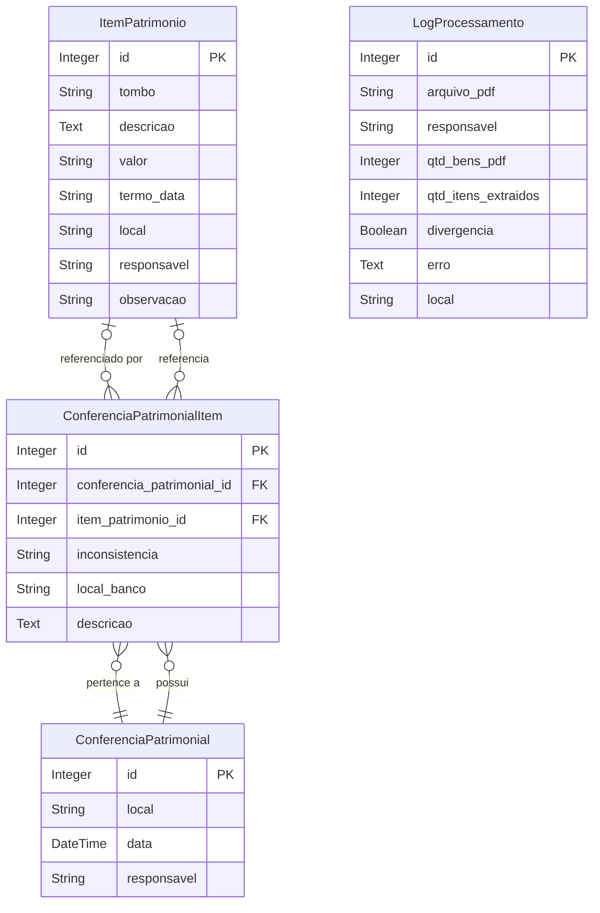

# Sistema de Inventário de Patrimônio

## Visão Geral

Este projeto é um sistema web para controle, conferência e inventário de patrimônio institucional, desenvolvido em Flask. Permite importar dados de PDFs, consultar e filtrar itens, realizar conferências patrimoniais por sala/local, gerar relatórios de conferência e manter histórico de conferências.

---

## Funcionalidades

- **Importação de PDFs**: Extração automática de itens de patrimônio a partir de arquivos PDF.
- **Consulta e Filtros**: Visualização dos itens cadastrados, com filtros por local, responsável e número do tombo.
- **Conferência Patrimonial**: Realize conferências por sala, digitando os tombos encontrados e gerando relatório de conferência.
- **Histórico de Conferências**: Salve e consulte conferências anteriores, com detalhamento dos itens encontrados, faltantes, desconhecidos e em local divergente.
- **Logs de Processamento**: Acompanhe o resultado da importação de PDFs.

---

## Requisitos

- Python 3.8+
- SQLite (padrão, já incluso)

### Bibliotecas Python
Veja `requirements.txt`:
- Flask
- Flask-SQLAlchemy
- Flask-Migrate
- Flask-WTF
- WTForms
- pdfplumber
- Werkzeug

---

## Instalação

1. Clone o repositório:
   ```bash
   git clone <url-do-repositorio>
   cd utf-patrimonio
   ```
2. Crie e ative um ambiente virtual:
   ```bash
   python3 -m venv venv
   source venv/bin/activate
   ```
3. Instale as dependências:
   ```bash
   pip install -r requirements.txt
   ```
4. Configure a aplicação (opcional: `.env` ou variáveis de ambiente).

---

## Migração do Banco de Dados

1. Inicialize as migrações (apenas na primeira vez):
   ```bash
   flask db init
   ```
2. Gere as migrações:
   ```bash
   flask db migrate -m "Criação das tabelas iniciais"
   ```
3. Aplique as migrações:
   ```bash
   flask db upgrade
   ```

---

## Como Usar

1. Execute a aplicação:
   ```bash
   python run.py
   ```
2. Acesse no navegador:
   - Importar PDFs: `http://localhost:5000/upload`
   - Itens: `http://localhost:5000/itens`
   - Conferências: `http://localhost:5000/conferencias_patrimoniais`
   - Nova Conferência: `http://localhost:5000/conferencia_patrimonial`
   - Logs: `http://localhost:5000/logs`

---

## Estrutura do Projeto

```
utf-patrimonio/
├── app/
│   ├── __init__.py
│   ├── config.py
│   ├── extensions.py
│   ├── models.py
│   ├── patrimonio/
│   │   ├── __init__.py
│   │   ├── forms.py
│   │   ├── routes.py
│   │   ├── services.py
│   │   └── utils.py
│   ├── templates/
│   │   ├── base.html
│   │   ├── upload.html
│   │   ├── itens.html
│   │   ├── logs.html
│   │   ├── conferencia_patrimonial.html
│   │   ├── conferencias_patrimoniais.html
│   │   ├── conferencia_patrimonial_detalhe.html
│   │   ├── conferencia_patrimonial_manual.html
│   │   ├── editar_conferencia_patrimonial.html
│   │   ├── editar_item_conferencia_patrimonial.html
│   │   ├── 404.html
│   │   └── 500.html
│   └── static/
├── instance/
│   └── app.db
├── migrations/
├── uploads/
├── requirements.txt
├── run.py
└── README.md
```

---

## Diagrama do Banco de Dados



---

## Observações
- O sistema utiliza SQLite por padrão, mas pode ser adaptado para outros bancos.
- O upload de PDFs e o processamento dependem do layout dos arquivos.
- A conferência patrimonial permite salvar e consultar históricos para auditoria.

---

## Licença

Este projeto é acadêmico e pode ser adaptado conforme necessidade institucional. 